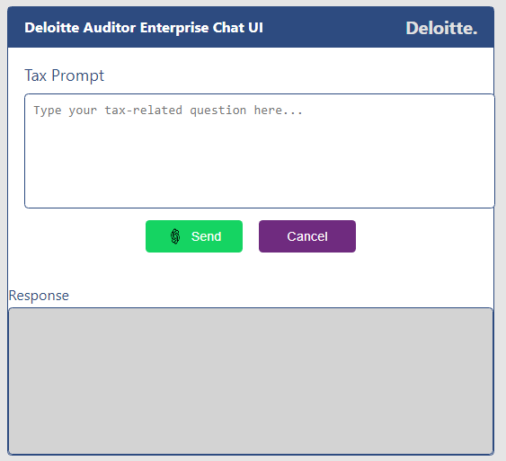
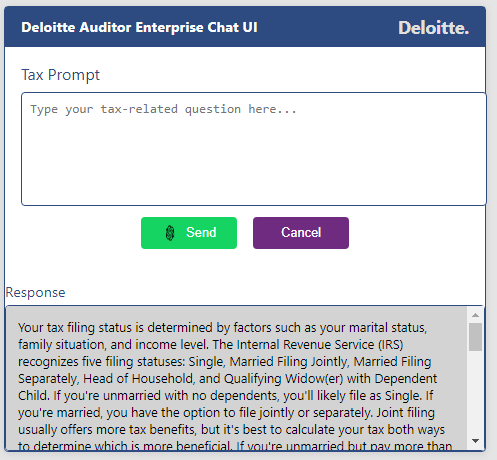
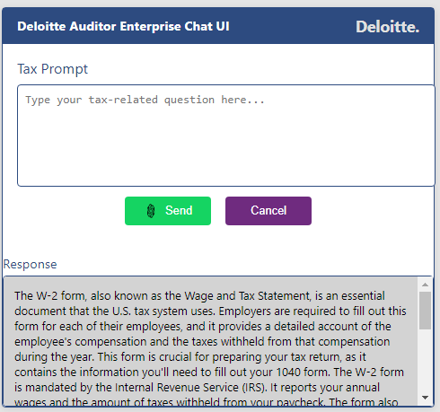
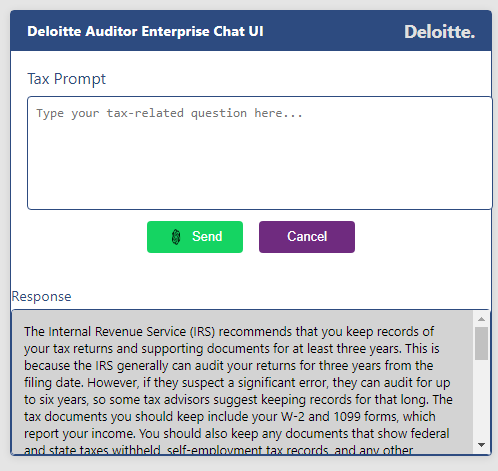
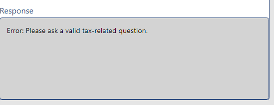

# Deloitte-Auditor-Enterprise-Chat-UI---Ajax-and-Restful-interface
Deloitte Auditor Enterprise Chat UI could refer to a chat-based interface or application designed to facilitate communication, collaboration, and reporting among auditors working on financial audits, risk assessments, or compliance checks for enterprises.

# Chatbot Application

A simple chatbot application built with Python Flask, enabling users to interact with a tax-related AI chatbot. The application supports user queries through a web interface and responds with relevant information. 

  

## Features

- **AJAX Support:** Asynchronous communication between the frontend and backend for a seamless user experience.
- **RESTful API:** A structured API to handle requests and responses for chat interactions.
- **Intuitive User Interface:** A clean and user-friendly web interface that allows users to enter tax-related questions easily.
- **Tax-Related Question Prompting:** Predefined templates for common tax-related questions to guide users in formulating their queries.
- **Prompt Engineering:** Customized prompt design that focuses on tax-related topics to ensure relevant and accurate responses from the GPT model.
- **OpenAI API Integration:** Seamless integration with the OpenAI API to retrieve responses based on user prompts.
- **Chat History and Data Storage:** Storage of user interactions (questions and responses) in a secure database for future reference.

## Technologies Used

- **Backend:**
  - Python
  - Flask
  - Flask-CORS (for Cross-Origin Resource Sharing)

  
- **Frontend:**
  - HTML
  - CSS
  - JavaScript
  - AJAX (for asynchronous data fetching)

## Installation

Follow the steps below to set up and run the application locally.

1. **Clone the repository:**

   ```bash
   git clone https://github.com/malluriaravind/Deloitte-Auditor-Enterprise-Chat-UI---Ajax-and-Restful-interface.git
   cd Deloitte-Auditor-Enterprise-Chat-UI---Ajax-and-Restful-interface
   ```


2. **Install the required packages:**

   ```bash
   pip install flask
   ```

4. **Set up the database**
   - The SQL table for storing prompts and responses will be created automatically when the application runs. Ensure you have the necessary permissions to create a database.

## Usage

1. **Run the Flask application:**

   ```bash
   python app.py
   ```

2. **Access the application:**
   Open your web browser and navigate to `http://127.0.0.1:5000`.

3. **Interact with the chatbot:**
   - Type your question in the input box and click the send button to receive responses from the chatbot.

## API Endpoints

### POST /api/tax-prompt

- **Description:** Sends a user question to the chatbot and retrieves an answer.
- **Request Body:**
  
  ```json
  {
    "question": "Your question here"
  }
  ```
- **Response:**
  
  ```json
  {
    "answer": "Chatbot response here"
  }
  ```
- - Chatbot Interface Providing Tax-Related Responses
-   
-   
-   
-   

### GET /api/get-chats

- **Description:** Retrieves the chat history for the user.
- **Response:**

  ```json
  [
    {
      "question": "Question 1",
      "answer": "Answer 1"
    },
    {
      "question": "Question 2",
      "answer": "Answer 2"
    }
  ]
  ```


## Frontend Implementation

The frontend of this application is built using standard web technologies. Here’s how it communicates with the backend:

- **AJAX calls** are made to the `/api/tax-prompt` endpoint to send user questions and receive answers asynchronously.
- The chat interface updates dynamically without requiring a page reload, providing a smooth user experience.

## Client Local Storage
- The application uses the browser's local storage to maintain a temporary record of user interactions.
- Users can access their previously submitted questions and responses even after refreshing the page.
- This allows for a seamless user experience and ensures that important information is readily available.

**Saving Data Locally**
- The application stores user chat history in the local storage as follows:
```
const chatHistory = JSON.parse(localStorage.getItem('chatHistory')) || [];
localStorage.setItem('chatHistory', JSON.stringify(chatHistory));
```
This allows users to persist their interactions without relying solely on server-side storage.

- You can check the prompt responses history at **chat_history.json** file.
 

## Contributing

Contributions are welcome! Please feel free to submit a pull request or open an issue. You can enhance the chatbot's capabilities, improve the UI, or optimize the backend logic.

